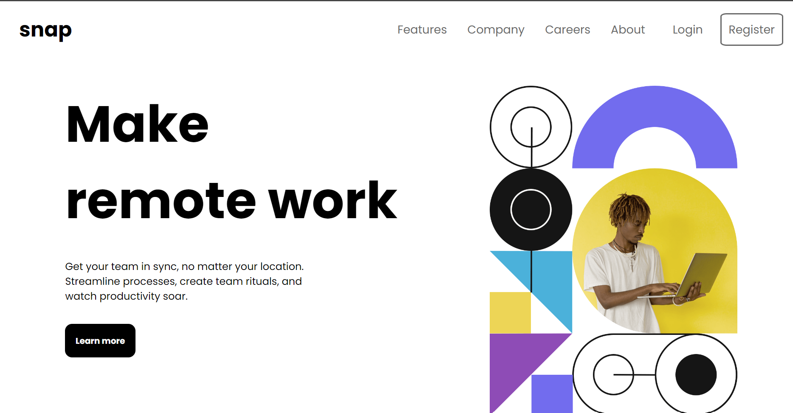
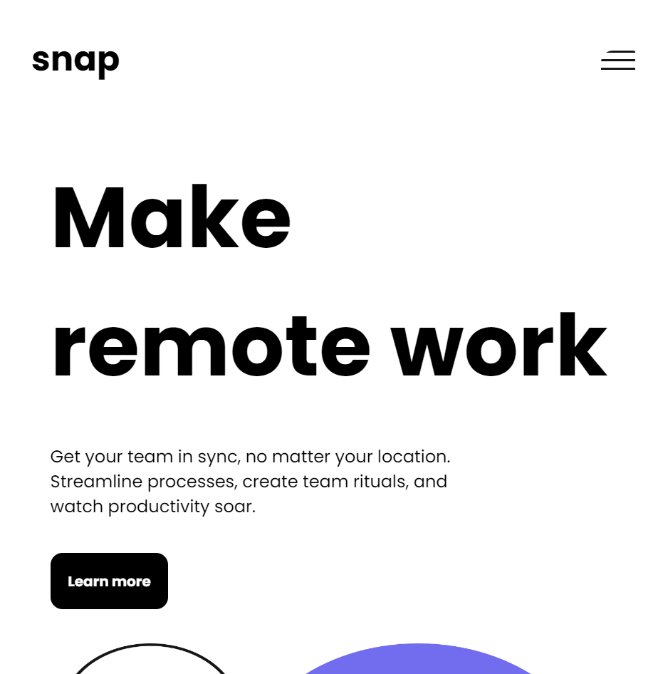
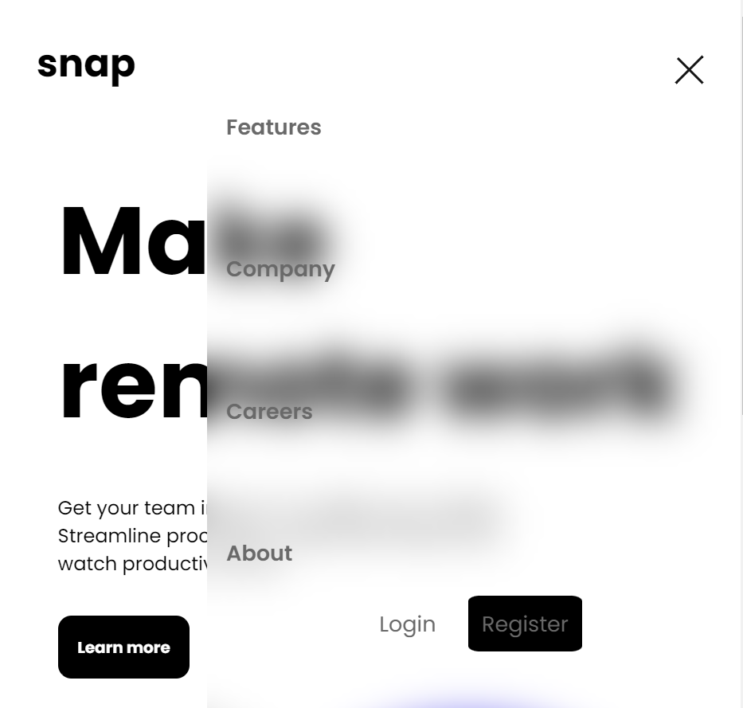

# Hello My Name is Keerthi Vardhan 

This is a solution to the [News homepage challenge on Frontend Mentor](https://www.frontendmentor.io/challenges/news-homepage-H6SWTa1MFl). Frontend Mentor challenges help you improve your coding skills by building realistic projects. 

## Table of contents

- [Overview](#overview)
  - [The challenge](#the-challenge)
  - [Screenshot](#screenshot)
  - [Links](#links)
- [My process](#my-process)
  - [Built with](#built-with)
  - [What I learned](#what-i-learned)
- [Author](#author)

## Overview
  - This is the beginner level project . 
  - skills used :- html5 , css3 , javaScript
### The challenge

Users should be able to:

- View the optimal layout for the interface depending on their device's screen size
- See hover and focus states for all interactive elements on the page

### Screenshot







### Links

- Solution URL: [https://github.com/Keerthivardhan1/news-homepage-main1](https://your-solution-url.com)
- Live Site URL: [https://rad-zabaione-7a3944.netlify.app](https://your-live-site-url.com)

## My process
  - responsiveness 
  - navbar - desktop and mobile 

### Built with

- Semantic HTML5 markup
- CSS custom properties
- Flexbox
- Desktop-first workflow

### What I learned
I have learnt how to create responsive navbar and about font-family
```js

togglebtn.addEventListener("click" , ()=>{
    console.log("clicked");
    if(four.style.display == "none"){
        four.style.display = "flex";            // no block its should be flex
        loginregister.style.display = "block";
        mobile_nav.style.height = "100vh";
        togglebtn.style.backgroundImage = "url('icon-close-menu.svg')";
        four.style.transform = "translateX(0%)"

    }else{
        four.style.display = "none";
        loginregister.style.display = "none";
        mobile_nav.style.height = "auto";
        togglebtn.style.backgroundImage = "url('icon-menu.svg')"
        four.style.transform = "translateX(100%)"
    }
})
 
```
## Author

- Linkedin - [KeerthiVardhan](https://www.linkedin.com/in/keerthi-vardhan-tekulapelli-7064a6245/)
- Frontend Mentor - [@Keerthivardhan1](https://www.frontendmentor.io/profile/Keerthivardhan1)
- Twitter - [@vardhan132003](https://www.twitter.com/yourusername)
